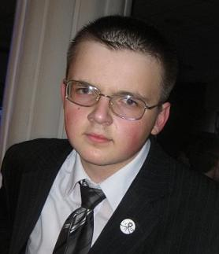

--- 
title: "Черновики за 2010-2018 годы"
author: "Павел Любецкий"
date: "2010-2018 годы"
site: bookdown::bookdown_site
output: bookdown::gitbook
documentclass: article 
mainfont: "Noto Sans"
language: ru
description: "Черновики за 2010-2018 годы"
---
# о книге {#about}

.

Привет, я Паша Любецкий. Эта книга -- мои черновики за 2010-2018 годы.

__Источники:__

- <https://web.archive.org/web/20180715042459/https://reuptake.github.io/>
- <https://web.archive.org/web/20171213223512/https://reuptake.github.io/>
- <https://web.archive.org/web/20170311131254/http://reuptake.github.io/art/poems-interesting.html>

__Лицензия:__ [Creative Commons Attribution Share Alike 4.0](https://creativecommons.org/licenses/by-sa/4.0/deed.ru).
